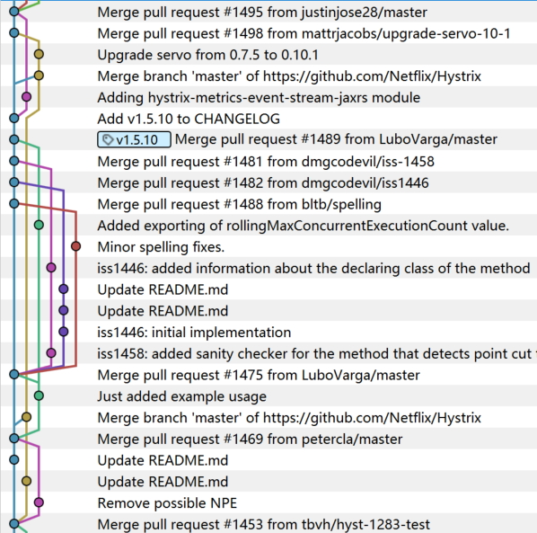

# 查看提交信息

打开仓库，checkout分支之后，就可以看到提交情况。

## 概况

如图，每一行代表一个提交/commit：

默认是按照时间排序(Data Order), 排在最上面的是最新的提交。可以修改为"Ancestor Order"/按照祖先排序.

默认是"All Branches"，所有分支的提交都会显示在这个界面上。可以在下拉框中选择"Current Branch"只看当前分支(和从当前分支拉出去再合并回来的分支)

"Show Remote Branches"选择是否显示远程分支的提交。(TBD: 貌似没有看到有什么差别后作用，后续再更新)

## 查看Graph

左边竖直的 Graph 是每个提交在各自 branch 上的一个示意图：

- 每行都有一个圆点，代表一次提交，不同分支的原点颜色不同。
- 竖线代表一个分支，颜色和原点一致。两条平行竖线代表两个不同的分支在并行开发。
- 从一个原点拉出一条新的竖线，表示从该分支的这个位置开始建立了一个新的分支
- 新的分支上的一个一个原点，表示在这个新分支上的陆续提交
- 新分支在若干次提交之后，于某处和原分支汇合，代表新分支合并会原分支

我们来看几种典型的开发流程对应的图形：

1. 多分支并行开发：体现在图形上是多条并行线，各自有提交

	

2. bugfix：体现在图形上，从原有branch拉出，提交bugfix之后迅速merge回来

	

	注意右边的提交信息，"Fix ....."和"Merge...."。

3. feature：体现在图形上，从原有branch拉出，提交多次，然后feature开发之后merge回来原来的branch

	

4. 多种方式混合：体现在图形上，先从原有branch拉出做bugfix，然后又拉出做feature，bugfix先merge回来，然后又拉出一个branch做第二个feature。最后两个feature完成再先后合并回来。

	

5. 开发中多次merge：看橙色的branch，从master branch拉出后，发现master做了两次提交，然后从master做了一次merge到橙色的branch。在橙色的branch后续开发的过程中，开了好几个branch陆陆续续修改完成再合并回master，这些修改随后做了第二个从master到橙色的branch的merge。最后橙色的branch完成，merge回master。

	

6. 分支上再拉分支：橙色的branch先拉出来，开发一点后，从橙色的branch拉了一个蓝紫色的分支，然后两个分支分别开发再陆续merge回master。

	

7. 开分支做merge：青色分支拉出来之后，开发完成，在准备merge回master时，master上已经有比较多的提交。为了避免过多冲突导致master不稳定，从master上临时拉了一个新的橙色分支出来，先完成和青色分支的merge，解决冲突之后，再一起merge回master。

	

## 查看提交信息

点击每个提交时，会显示这个提交的信息：

- Commit：每个提交的SHA，如"562d01f26150d68a12b0e7030c28bbe3e6bf84c4",通常简写为前8位。可以右键点这个提交，然后选"Copy SHA to Clipboard",复制这个SHA值到粘贴板。
- Parents：每次提交的parent，对于普通提交，只有一个parent。但是对于merge操作的commit则通常有两个parent。
- Author：作者信息，name + email，我们前面设置的user information显示在这里
- Date：提交的时间。注意是每个commit操作的时间，不是push的时间。
- Committer：TBD 待查
- comments： 下面的内容是每次commit时填写的comments

## 查看文件修改列表

出现在提交信息下方的是本地提交的文件修改列表：

文件前面的图标有明确的意义：

- : 文件内容发生更改，但是文件本身的存在性没有变化（即不是新增也没有删除）
- ：增加的新文件
- ：删除的文件

## 查看文件内容修改

点击文件修改列表中的每一个文件，就会在右边出现该文件的内容修改情况。

文件内容修改通常是以下几种情况：

1. 增加内容：表现为绿色背景，行最前面是加号

	

2. 删除内容：表现为淡红色背景，行最前面是减号

	

3. 修改内容：由于git对内容的处理是以行为单位，因此无法直接体现出来是修改了该行的哪部分内容，在git中对行内容的修改表现为一次删除+一次增加。

	典型如下，实际只是修改"3.1.2"为"3.2.2":

	

	下面是另外一个典型，实际该行没有实质修改，只是语法要求最后的";"在增加新的枚举后要修改为",":

	
